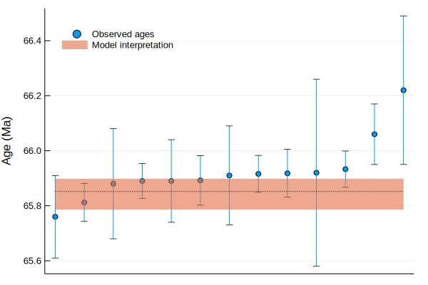
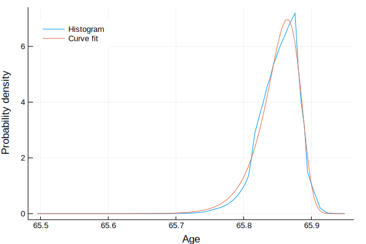
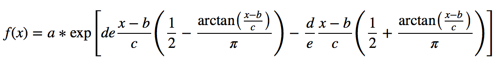
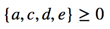
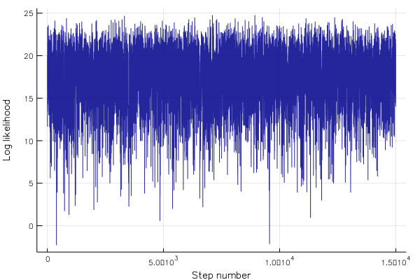
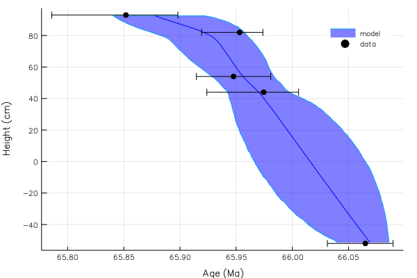
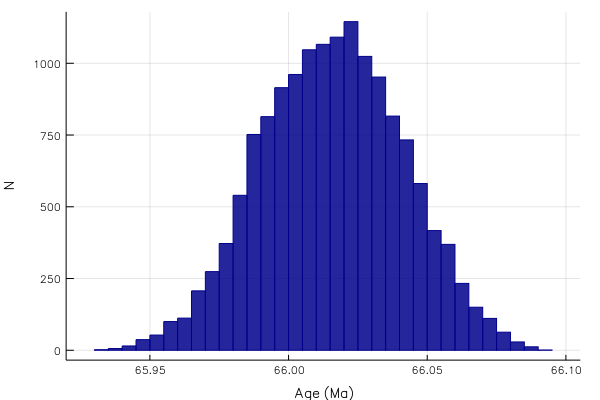
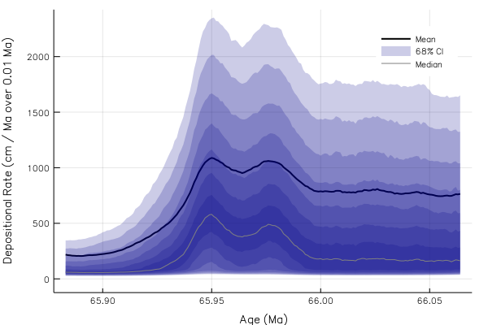

# Chron.jl

[](https://doi.org/10.17605/OSF.IO/TQX3F)

A two-part framework for (1) estimating eruption/deposition age distributions from complex mineral age spectra and (2) subsequently building a stratigraphic age model based on those distributions. Each step relies on a Markov-Chain Monte Carlo model.

The first (distribution) MCMC model is based on the work of [Keller, Schoene, and Samperton (2018)]( https://doi.org/10.7185/geochemlet.1826) and uses information about the possible shape of the true mineral crystallization (or closure) age distribution (e.g., no crystallization possible after eruption or deposition). In this first model, the true eruption or deposition age is a parameter of this scaled crystallization distribution. The stationary distribution of this first MCMC model then gives an estimate of the eruption/deposition age.

The second (stratigraphic) MCMC model, developed for use in [Schoene et al. (2019)](https://doi.org/10.1126/science.aau2422) and [Deino et al. (2019)](https://doi.org/10.1016/j.quascirev.2019.05.009) among others, uses the estimated (posterior) eruption/deposition age distributions along with the constraint of stratigraphic superposition to produce an age-depth model. This stratigraphic model can incorporate either standard Gaussian or asymmetric empirical distributions as age constraints, as well additional complications such as hiatuses of known minimum duration, height uncertainty, and one-sided age constraints. The stationary distribution of this second MCMC model yields an estimate of age at each model horizon throughout the section.

## Installation
Chron.jl is written in the [Julia programming language](https://julialang.org/).

In the Julia package manager (type `]` in the REPL)
```Julia
(v1.0) pkg> add "https://github.com/brenhinkeller/Chron.jl"
```
or for previous versions of Julia, in the REPL
```Julia
julia> Pkg.clone("https://github.com/brenhinkeller/Chron.jl")
```

## Online / Notebook Usage
### Coupled eruption/deposition age and age-depth modelling
For a quick test (without having to install anything), try the [interactive online Jupyter notebook](https://mybinder.org/v2/gh/brenhinkeller/Chron.jl/master?filepath=examples%2Fdemo.ipynb) (note: it'll take a few minutes for the notebook to launch). [](https://mybinder.org/v2/gh/brenhinkeller/Chron.jl/master?filepath=examples%2Fdemo.ipynb)

This runs [examples/demo.ipynb](examples/demo.ipynb) on a [JupyterHub](https://github.com/jupyterhub/jupyterhub) server hosted by the [Binder](https://mybinder.org) project. If you make changes to the interactive online notebook, you can save them with `File` > `Download as` > `Notebook (.ipynb)` To run a downloaded notebook locally, use [IJulia](https://github.com/JuliaLang/IJulia.jl)

```Julia
julia> using IJulia
julia> notebook()
```

### Standalone age-depth modelling
If you want to use Chron.jl for for age-depth modelling without the eruption/deposition age estimation step, there are also example notebooks standalone age-depth modelling using either [simple Gaussian age constraints](https://mybinder.org/v2/gh/brenhinkeller/Chron.jl/master?filepath=examples%2FChron1.0StratOnly.ipynb) [](https://mybinder.org/v2/gh/brenhinkeller/Chron.jl/master?filepath=examples%2FChron1.0StratOnly.ipynb) or [non-Gaussian radiocarbon age constraints](https://mybinder.org/v2/gh/brenhinkeller/Chron.jl/master?filepath=examples%2FChron1.0Radiocarbon.ipynb) [](https://mybinder.org/v2/gh/brenhinkeller/Chron.jl/master?filepath=examples%2FChron1.0Radiocarbon.ipynb), with or without hiatuses.

## Standard Usage
After installing [Julia](https://julialang.org/downloads/) with or without [Juno](http://junolab.org/), and Chron.jl (above), run [examples/demo.jl](examples/demo.jl) to see how the code works. It should look something like this:

#### Load necessary Julia packages
```julia
if VERSION>=v"0.7"
    using Statistics, StatsBase, DelimitedFiles, SpecialFunctions
else
    using Compat
end

using Chron

using Plots; gr();
```

#### Enter sample information
This example data is from Clyde et al. (2016) "Direct high-precision
U–Pb geochronology of the end-Cretaceous extinction and calibration of
Paleocene astronomical timescales" EPSL 452, 272–280.
doi: [10.1016/j.epsl.2016.07.041](https://doi.org/10.1016/j.epsl.2016.07.041)


```julia
nSamples = 5 # The number of samples you have data for
smpl = NewStratAgeData(nSamples)
smpl.Name      =   ("KJ08-157", "KJ04-75", "KJ09-66", "KJ04-72", "KJ04-70",)
smpl.Height[:] =   [     -52.0,      44.0,      54.0,      82.0,      93.0,]
smpl.Height_sigma[:] = [   3.0,       1.0,       3.0,       3.0,       3.0,]
smpl.Age_Sidedness[:] = zeros(nSamples) # Sidedness (zeros by default: geochron constraints are two-sided). Use -1 for a maximum age and +1 for a minimum age, 0 for two-sided
smpl.Path = "DenverUPbExampleData/" # Where are the data files?
smpl.inputSigmaLevel = 2 # i.e., are the data files 1-sigma or 2-sigma. Integer.

AgeUnit = "Ma" # Unit of measurement for ages and errors in the data files
HeightUnit = "cm"; # Unit of measurement for Height and Height_sigma
```

For each sample in `smpl.Name`, we must have a `.csv` file in `smpl.Path` which contains each individual mineral age and uncertainty. For instance, [examples/DenverUPbExampleData/KJ08-157.csv](examples/DenverUPbExampleData/KJ08-157.csv) contains:
```
66.12,0.14
66.115,0.048
66.11,0.1
66.11,0.17
66.096,0.056
66.088,0.081
66.085,0.076
66.073,0.084
66.07,0.11
66.055,0.043
66.05,0.16
65.97,0.12
```

#### Configure and run eruption/deposition age model
To learn more about the eruption/deposition age estimation model, see also [Keller, Schoene, and Sameperton (2018)](https://doi.org/10.7185/geochemlet.1826) and the [BayeZirChron demo notebook](http://brenh.in/BayeZirChron). It is important to note that this model (like most if not all others) has no knowledge of open-system behaviour, so *e.g.*, Pb-loss will lead to erroneous results.


```julia
# Number of steps to run in distribution MCMC
distSteps = 10^7
distBurnin = floor(Int,distSteps/100)

# Choose the form of the prior distribution to use.
# A variety of potentially useful distributions are provided in DistMetropolis.jl - Options include UniformDisribution,
# TriangularDistribution, BootstrappedDistribution, and MeltsVolcanicZirconDistribution - or you can define your own.
dist = TriangularDistribution;

# Run MCMC to estimate saturation and eruption/deposition age distributions
smpl = tMinDistMetropolis(smpl,distSteps,distBurnin,dist);
```

    Estimating eruption/deposition age distributions...
    1: KJ08-157
    2: KJ04-75
    3: KJ09-66
    4: KJ04-72
    5: KJ04-70


Let's see what that did
```julia
; ls $(smpl.Path)
results = readdlm(smpl.Path*"results.csv",',')
; open $(smpl.Path*"KJ04-75_rankorder.pdf")
```

    BootstrappedDistribution.pdf
    KJ04-70.csv
    KJ04-70_distribution.pdf
    KJ04-70_rankorder.pdf
    KJ04-72.csv
    KJ04-72_distribution.pdf
    KJ04-72_rankorder.pdf
    KJ04-75.csv
    KJ04-75_distribution.pdf
    KJ04-75_rankorder.pdf
    KJ08-157.csv
    KJ08-157_distribution.pdf
    KJ08-157_rankorder.pdf
    KJ09-66.csv
    KJ09-66_distribution.pdf
    KJ09-66_rankorder.pdf
    KJ12-01.csv
    results.csv


    6×5 Array{Any,2}:
     "Sample"      "Age"    "2.5% CI"    "97.5% CI"   "sigma"
     "KJ08-157"  66.065   66.0312      66.0896       0.0151996
     "KJ04-75"   65.9744  65.9237      66.0056       0.0198365
     "KJ09-66"   65.9475  65.9143      65.9807       0.0168379
     "KJ04-72"   65.9531  65.9194      65.9737       0.0135548
     "KJ04-70"   65.8518  65.7857      65.898        0.0288371


Let's look at the plots for sample KJ04-70:



For each sample, the eruption/deposition age distribution is inherently asymmetric, because of the one-sided relationship between mineral closure and eruption/deposition. For example:



Consequently, rather than simply taking a mean and standard deviation of the stationary distribtuion of the Markov Chain, the histogram of the stationary distribution is fit to an empirical distribution function of the form





where



*i.e.*, an asymmetric exponential function with two log-linear segments joined with an arctangent sigmoid. After fitting, the five parameters $a$ - $e$ are stored in `smpl.params` and passed to the stratigraphic model

#### Configure and run stratigraphic model
note: to spare Binder's servers, this demo uses
```
config.nsteps = 3000
config.burnin = 2000*npoints_approx
```
However, you probably want higher numbers for a publication-quality result, for instance
```
config.nsteps = 30000 # Number of steps to run in distribution MCMC
config.burnin = 10000*npoints_approx # Number to discard
```
and examine the log likelihood plot to make sure you've converged.

To run the stratigraphic MCMC model, we call the `StratMetropolisDist` function. If you want to skip the first step and simply input run the stratigraphic model with Gaussian mean age and standard deviation for some number of stratigraphic horizons, then you can set `smpl.Age` and `smpl.Age_sigma` directly, but then you'll need to call `StratMetropolis` instead of `StratMetropolisDist`


```julia
# Configure the stratigraphic Monte Carlo model
config = NewStratAgeModelConfiguration()
# If you in doubt, you can probably leave these parameters as-is
config.resolution = 1.0 # Same units as sample height. Smaller is slower!
config.bounding = 0.1 # how far away do we place runaway bounds, as a fraction of total section height
(bottom, top) = extrema(smpl.Height)
npoints_approx = round(Int,length(bottom:config.resolution:top) * (1 + 2*config.bounding))
config.nsteps = 15000 # Number of steps to run in distribution MCMC
config.burnin = 10000*npoints_approx # Number to discard
config.sieve = round(Int,npoints_approx) # Record one out of every nsieve steps

# Run the stratigraphic MCMC model
(mdl, agedist, lldist) = StratMetropolisDist(smpl, config); sleep(0.5)

# Plot the log likelihood to make sure we're converged (n.b burnin isn't recorded)
plot(lldist,xlabel="Step number",ylabel="Log likelihood",label="",line=(0.85,:darkblue))=
```

    Generating stratigraphic age-depth model...
    Burn-in: 1750000 steps
    Collecting sieved stationary distribution: 2625000 steps





#### Plot results
```julia
# Plot results (mean and 95% confidence interval for both model and data)
hdl = plot([mdl.Age_025CI; reverse(mdl.Age_975CI)],[mdl.Height; reverse(mdl.Height)], fill=(minimum(mdl.Height),0.5,:blue), label="model")
plot!(hdl, mdl.Age, mdl.Height, linecolor=:blue, label="", fg_color_legend=:white)
plot!(hdl, smpl.Age, smpl.Height, xerror=(smpl.Age-smpl.Age_025CI,smpl.Age_975CI-smpl.Age),label="data",seriestype=:scatter,color=:black)
plot!(hdl, xlabel="Age ($AgeUnit)", ylabel="Height ($HeightUnit)")
savefig(hdl,"AgeDepthModel.pdf");
display(hdl)
```





```julia
# Interpolate results at KTB (height = 0)
height = 0
KTB = linterp1s(mdl.Height,mdl.Age,height)
KTB_min = linterp1s(mdl.Height,mdl.Age_025CI,height)
KTB_max = linterp1s(mdl.Height,mdl.Age_975CI,height)
print("Interpolated age: $KTB +$(KTB_max-KTB)/-$(KTB-KTB_min) Ma")

# We can also interpolate the full distribution:
interpolated_distribution = Array{Float64}(undef,size(agedist,2))
for i=1:size(agedist,2)
    interpolated_distribution[i] = linterp1s(mdl.Height,agedist[:,i],height)
end
histogram(interpolated_distribution, xlabel="Age (Ma)", ylabel="N", label="", fill=(0.85,:darkblue), linecolor=:darkblue)
```





    Interpolated age: 66.01580546918152 +0.04924877964148777/-0.049571492234548487 Ma

There are other things we can plot as well, such as deposition rate:


```julia
# Set bin width and spacing
binwidth = 0.01 # Myr
binoverlap = 10
ages = collect(minimum(mdl.Age):binwidth/binoverlap:maximum(mdl.Age))
bincenters = ages[1+Int(binoverlap/2):end-Int(binoverlap/2)]
spacing = binoverlap

# Calculate rates for the stratigraphy of each markov chain step
dhdt_dist = Array{Float64}(undef, length(ages)-binoverlap, config.nsteps)
@time for i=1:config.nsteps
    heights = linterp1(reverse(agedist[:,i]), reverse(mdl.Height), ages)
    dhdt_dist[:,i] = abs.(heights[1:end-spacing] - heights[spacing+1:end]) ./ binwidth
end

# Find mean and 1-sigma (68%) CI
dhdt = nanmean(dhdt_dist,dim=2)
dhdt_50p = nanmedian(dhdt_dist,dim=2)
dhdt_16p = pctile(dhdt_dist,15.865,dim=2) # Minus 1-sigma (15.865th percentile)
dhdt_84p = pctile(dhdt_dist,84.135,dim=2) # Plus 1-sigma (84.135th percentile)
# Other confidence intervals (10:10:50)
dhdt_20p = pctile(dhdt_dist,20,dim=2)
dhdt_80p = pctile(dhdt_dist,80,dim=2)
dhdt_25p = pctile(dhdt_dist,25,dim=2)
dhdt_75p = pctile(dhdt_dist,75,dim=2)
dhdt_30p = pctile(dhdt_dist,30,dim=2)
dhdt_70p = pctile(dhdt_dist,70,dim=2)
dhdt_35p = pctile(dhdt_dist,35,dim=2)
dhdt_65p = pctile(dhdt_dist,65,dim=2)
dhdt_40p = pctile(dhdt_dist,40,dim=2)
dhdt_60p = pctile(dhdt_dist,60,dim=2)
dhdt_45p = pctile(dhdt_dist,45,dim=2)
dhdt_55p = pctile(dhdt_dist,55,dim=2)

# Plot results
hdl = plot(bincenters,dhdt, label="Mean", color=:black, linewidth=2)
plot!(hdl,[bincenters; reverse(bincenters)],[dhdt_16p; reverse(dhdt_84p)], fill=(minimum(mdl.Height),0.2,:darkblue), linealpha=0, label="68% CI")
plot!(hdl,[bincenters; reverse(bincenters)],[dhdt_20p; reverse(dhdt_80p)], fill=(minimum(mdl.Height),0.2,:darkblue), linealpha=0, label="")
plot!(hdl,[bincenters; reverse(bincenters)],[dhdt_25p; reverse(dhdt_75p)], fill=(minimum(mdl.Height),0.2,:darkblue), linealpha=0, label="")
plot!(hdl,[bincenters; reverse(bincenters)],[dhdt_30p; reverse(dhdt_70p)], fill=(minimum(mdl.Height),0.2,:darkblue), linealpha=0, label="")
plot!(hdl,[bincenters; reverse(bincenters)],[dhdt_35p; reverse(dhdt_65p)], fill=(minimum(mdl.Height),0.2,:darkblue), linealpha=0, label="")
plot!(hdl,[bincenters; reverse(bincenters)],[dhdt_40p; reverse(dhdt_60p)], fill=(minimum(mdl.Height),0.2,:darkblue), linealpha=0, label="")
plot!(hdl,[bincenters; reverse(bincenters)],[dhdt_45p; reverse(dhdt_55p)], fill=(minimum(mdl.Height),0.2,:darkblue), linealpha=0, label="")
plot!(hdl,bincenters,dhdt_50p, label="Median", color=:grey, linewidth=1)
plot!(hdl, xlabel="Age ($AgeUnit)", ylabel="Depositional Rate ($HeightUnit / $AgeUnit over $binwidth $AgeUnit)", fg_color_legend=:white)
# savefig(hdl,"DepositionRateModelCI.pdf")
display(hdl)
```





### Stratigraphic model including hiatuses
We can also deal with discrete hiatuses in the stratigraphic section if we know where they are and about how long they lasted. We need some different models and methods though. In particular, in addition to the `StratAgeData` struct, we also need a `HiatusData` struct now, and we're going to want to pass these to `StratMetropolisDistHiatus` instead of `StratMetropolisDist` like before.


```julia
# Data about hiatuses
nHiatuses = 2 # The number of hiatuses you have data for
hiatus = NewHiatusData(nHiatuses) # Struct to hold data
hiatus.Height         = [20.0, 35.0 ]
hiatus.Height_sigma   = [ 0.0,  0.0 ]
hiatus.Duration       = [ 0.2,  0.43]
hiatus.Duration_sigma = [ 0.05, 0.07]

# Run the model. Note: we're using `StratMetropolisDistHiatus` now, instead of just `StratMetropolisDistHiatus`
(mdl, agedist, hiatusdist, lldist) = StratMetropolisDistHiatus(smpl, hiatus, config); sleep(0.5)

# Plot results (mean and 95% confidence interval for both model and data)
hdl = plot([mdl.Age_025CI; reverse(mdl.Age_975CI)],[mdl.Height; reverse(mdl.Height)], fill=(minimum(mdl.Height),0.5,:blue), label="model")
plot!(hdl, mdl.Age, mdl.Height, linecolor=:blue, label="", fg_color_legend=:white)
plot!(hdl, smpl.Age, smpl.Height, xerror=(smpl.Age-smpl.Age_025CI,smpl.Age_975CI-smpl.Age),label="data",seriestype=:scatter,color=:black)
plot!(hdl, xlabel="Age (Ma)", ylabel="Height (cm)")
```

    Generating stratigraphic age-depth model...
    Burn-in: 1750000 steps
    Collecting sieved stationary distribution: 2625000 steps


